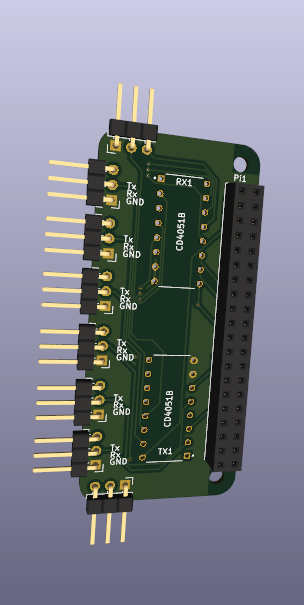
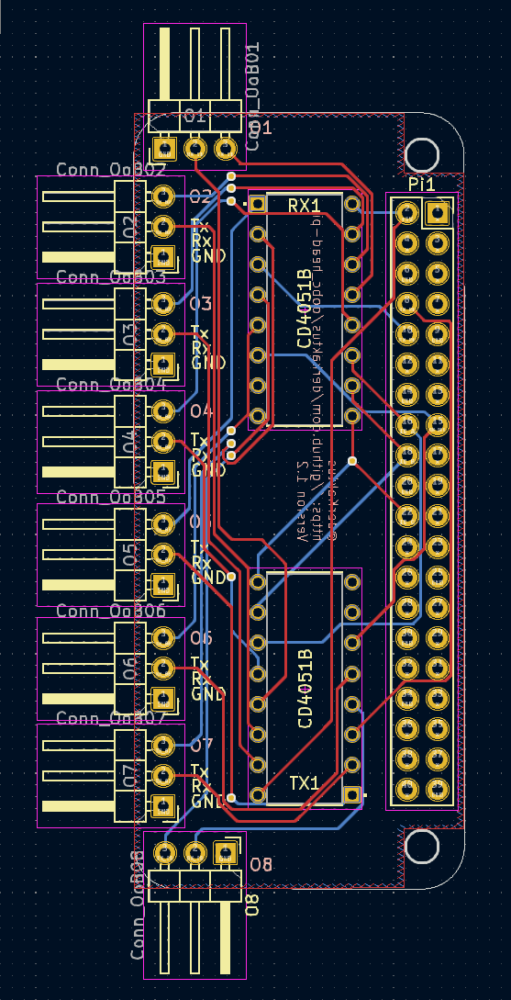

# OutofBand Console Server Head for Raspberry Pi

Upgrade your Raspberry Pi to an eight port serial console server for OoB management.

  
 
 

## Function
The head utilizes the build in UART capability of the raspberry pi (only UART0) and adds the 8 port switching capability. 
The port can be selected via pin 16, 18 and 22 a.k.a. **GPIO 22, 23** and **25** by adjusting their HIGH LOW state.

| PORT |GPIO>  | 22 | 23 | 25 |
|--|--| -- | -- | -- |
| 1 |  | 0 | 0 | 0 |
| 2 |  | 1 | 0 | 0 |
| 3 |  | 0 | 1 | 0 |
| 4 |  | 1 | 1 | 0 |
| 5 |  | 0 | 0 | 1 |
| 6 |  | 1 | 0 | 1 |
| 7 |  | 0 | 1 | 1 |
| 8 |  | 1 | 1 | 1 |

## Component
- 1x Pin Header 2x20 for Raspberry Pi
- 2x CD4051BE IC (Analog Multiplexer Single 8)

Optional: 
- 2x IC Socket 16 / 2x8 pin

Watch for the 2.54 mm pitch versions !!
